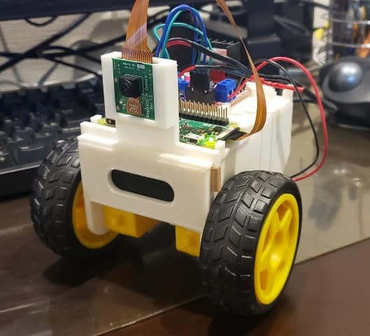
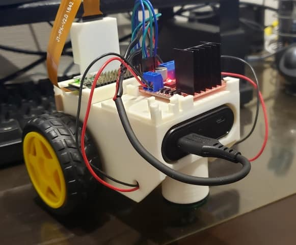
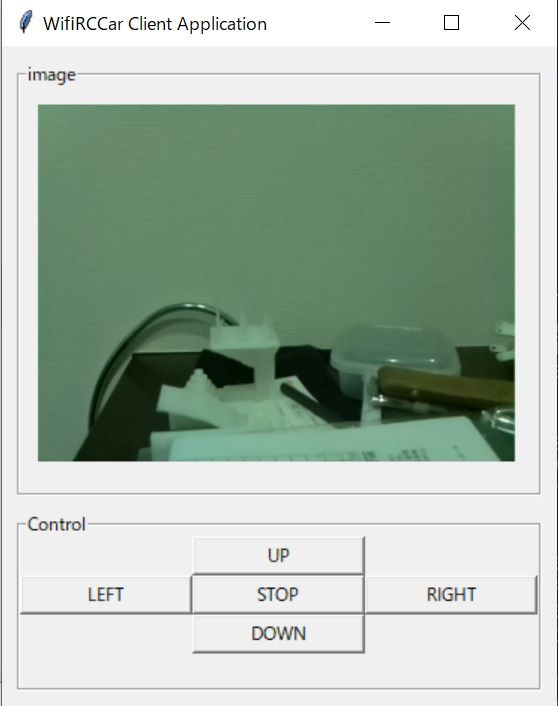

# WifiRCCar

Wifi RC Car Project

# Wifi RC Car

## 本体イメージ

|正面 | 後ろ |
|:---:|:---:|
|| |

## リモコンイメージ



# 依存関連

## Server

- pigpio

## Client

None

# CAD

- FreeCAD 0.18を使って作成。
- 3D Printerで出力（ Flashforge Adventurer3 ）。フィラメントはABSを利用。
- パーツ同士を接着剤で接続している。

# モータドライバとRaspberry piの接続

| Motor Driver | GPIO | PIN |
|:------------:|:----:|:---:|
| ENABLE A     | -    | -   |
| INPUT1       | 17   | 11  |
| INPUT2       | 27   | 13  |
| ENABLE B     | -    | -   |
| INPUT3       | 23   | 16  |
| INPUT4       | 24   | 18  |

# ソフトウェアの使い方

## server

コントローラにはrpi zeroを利用。
rpi zeroで以下を実行する。
```
$ sudo pigpiod
$python3 software/server/python3  http_server.py -s $ip -p $port
```

## client

リモコンはpythonが動くPCを想定している。
接続先のIPアドレスおよびportはコード上にハードコーディングされているため、修正の必要がある。
PCで以下を実行する。

```
python3 software/client/client.py
```